# Система учёта посещаемости — полное описание

## Краткое описание проекта

Система учёта посещаемости предназначена для автоматической отметки студентов на занятиях с помощью бесконтактных студенческих пропусков. Преподаватель использует Android-приложение: подносит пропуск к телефону, приложение считывает UID, подписывает запрос приватным ключом из Android Keystore и отправляет на сервер. Сервер проверяет подпись, находит студента и фиксирует время входа или выхода.

В системе три роли: преподаватель (отмечает и смотрит списки), админ (управляет студентами, кодами регистрации и устройствами) и сотрудник вуза (принимает и проверяет бумажные согласия и заявления). Студент взаимодействует с системой только через пропуск и бумажные документы.

Обработка персональных данных ведётся на основании бумажных согласий. При отзыве согласия персональные данные зануляются, а записи о посещаемости сохраняются в обезличенном виде. Согласия, заявления и акты об уничтожении существуют на бумаге и хранятся в деле вуза.

## Предусловия и границы проекта

**В скоуп входит:**
- Регистрация Android-устройства преподавателя через одноразовый код.
- Отметка посещаемости студента путём чтения UID студенческого пропуска.
- Просмотр списка пришедших по дисциплине, группе и дате.
- Управление студентами, кодами регистрации и устройствами через админ-панель.
- Учёт согласий и отзывов с фиксацией в базе. Бумажные документы — вне системы.
- Распространение APK преподавателям через ссылку в админ-панели.
- Журнал событий: регистрация неуспешных попыток и важных действий для разбора инцидентов.

**В скоуп не входит:**
- Замена преподавателя. Устройство всегда отмечает от имени того преподавателя, к которому привязано при регистрации.
- Автоматический сбор персональных данных студентов.
- Интеграция с расписанием.
- Платежи, библиотека, проходная.
- Хранение фотографий студентов для визуальной сверки преподавателем. Фотография, используемая для идентификации личности, может квалифицироваться как биометрические персональные данные (ст. 11 152-ФЗ). Их обработка требует отдельного письменного согласия, что усложняет сбор документов и увеличивает риск штрафов.

**Ручные операции (вне системы):**
- Студент подписывает бумажное согласие на обработку персональных данных.
- Студент подписывает бумажное заявление об отзыве согласия.
- Сотрудник вуза принимает документы, проверяет их и передаёт админу.
- Админ переносит данные в систему и подписывает акт об уничтожении персональных данных.
- Бумажные оригиналы хранятся в деле вуза.

### Используемый носитель

В качестве студенческого пропуска используется карта на базе NXP MIFARE Plus. Исследование показало, что такие карты применяются в кампусных системах. В режиме SL3 данные защищены AES-128, но UID доступен без аутентификации. Для учёта посещаемости достаточно только UID: чтение защищённых секторов не требуется, а без ключей администратора оно и невозможно.

На схемах ниже носитель обозначен как «Студенческий пропуск», чтобы подчеркнуть прикладную роль, а не конкретную модель чипа.

### 152-ФЗ и обработка персональных данных

Обработка персональных данных студентов ведётся на основании бумажного согласия. Согласие фиксируется в системе номером и датой документа. Бумажный оригинал хранится в деле вуза.

При отзыве согласия студент подаёт письменное заявление. Сотрудник вуза принимает и проверяет документ, после чего передаёт его админу. Админ вносит номер и дату заявления в систему. Система зануляет персональные данные студента:
- `full_name = NULL`
- `uid = NULL`

Записи о посещаемости сохраняются в обезличенном виде: они остаются связанными с внутренним `student_id`, но этот идентификатор больше не позволяет определить личность. После отзыва админ формирует и подписывает акт об уничтожении персональных данных. Срок обработки после отзыва — не более 30 дней.

## Технологии

### Выбор технологического стека

Финальные решения по СУБД и фреймворкам принимаются после выбора хостинга.

**Последовательность:**

1. Команда исследует хостинги (совместно или по устной договоренности).
2. Команда определяет хостинг и доступную на нём СУБД: **PostgreSQL 10+** или **MySQL 8.0+**.
3. DB + Admin API пишет миграции и сиды под выбранную СУБД.
4. Схема данных (см. ниже) описана универсально — в двух колонках указаны типы под обе СУБД. Скрипты пишутся только под одну.

- **PostgreSQL 10+** — из-за `jsonb` и GIN-индексов.
- **MySQL 8.0+** — из-за `JSON`-типа, generated columns и CTE, которые нужны для индексации `meta` в журнале событий.

Все бизнес-требования реализуются на обеих СУБД.

| Решение | Варианты |
|---|---|
| СУБД | PostgreSQL 10+, MySQL 8.0+ |
| Бэкенд | Python (Flask, FastAPI, Django), Node.js, Go |
| Фронтенд | SPA (React, Vue, Svelte), серверные шаблоны (Flask/Jinja2, Django templates) |
| Android | Kotlin + Jetpack Compose (предпочтительно), Kotlin + XML Views |

| Решение | Как решается |
|---|---|
| Конкретные библиотеки (SQLAlchemy и другие) | По мере необходимости после выбора фреймворка |
| ORM | На усмотрение разработчика после выбора фреймворка |
| Инструмент миграций | На усмотрение разработчика. Если фреймворк не требует явных миграций, не усложняем |
| CI/CD | Не нужен для проекта |
| Мониторинг | Только журнал событий |

**На дружественном хостинге** доступен вариант **Flask / FastAPI / Node.js + MySQL без Docker**. Развёртывание ручное, локальная разработка всё равно в Docker с той же СУБД. Может быть использован, если другие варианты не подходят.

### Требования к развёртыванию

- **Хостинг**: бесплатный или условно-бесплатный, с поддержкой выбранного стека. Docker не обязателен.
- **Git-хостинг**: GitHub.
- **Репозиторий**: один общий репозиторий (монорепо) с папками `backend/`, `frontend/`, `db/`, `android/`, `docs/`. В корне — `docker-compose.yml`.
- **Рабочая среда**: Docker для зависимостей, локальный рантайм для своего кода.
- **Ветки**: `main` (стабильная) и `dev` (интеграционная). Работа — в отдельных ветках от `dev`.
- **Среды**: предполагается наличие тестовой и продовой среды. Тестовая среда используется для проверок QA и командой: на ней разворачиваются тестовые сборки API, админ-панели и APK. Продовая — для реальной работы преподавателей.
- **Хостинг APK**: файл release-APK хранится в статике на том же хостинге, что API. Ссылка размещается в админ-панели.
- **СУБД**: PostgreSQL 10+ или MySQL 8.0+ — конкретная выбирается по тому, что доступно на найденном хостинге.
- **Доступность API**: API доступен извне по HTTPS. Android-приложение подключается к нему из любой сети.
- **Версионирование API**: пути начинаются с `/v1/`.
- **Формат ответов**: единый JSON.
- **Минимальная версия Android**: minSdk = 26. Требуется для стабильной работы NFC и Android Keystore.
- **Формат аутентификации админа**: JWT или серверные сессии — определяется после выбора фреймворка бэкенда.
- **Статика**: APK, макеты и другие медиа лежат в статике на том же хостинге, что API.
- **Журнал событий**: значимые события (неуспешные попытки, ошибки, важные действия) сохраняются в БД и доступны через админ-панель. Технические логи (HTTP-запросы, traceback) пишутся автоматически и доступны через панель хостинга.

## Архитектура системы

### C1. System Context

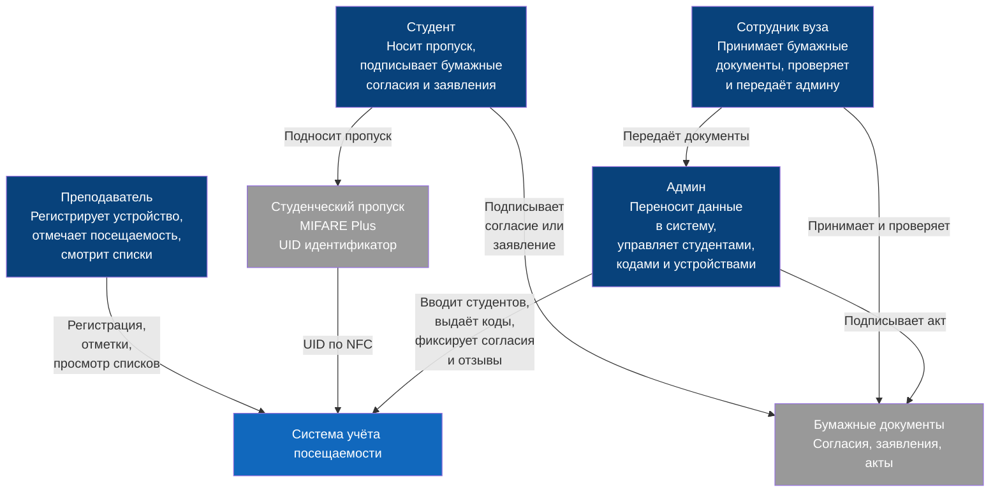

### C2. Container

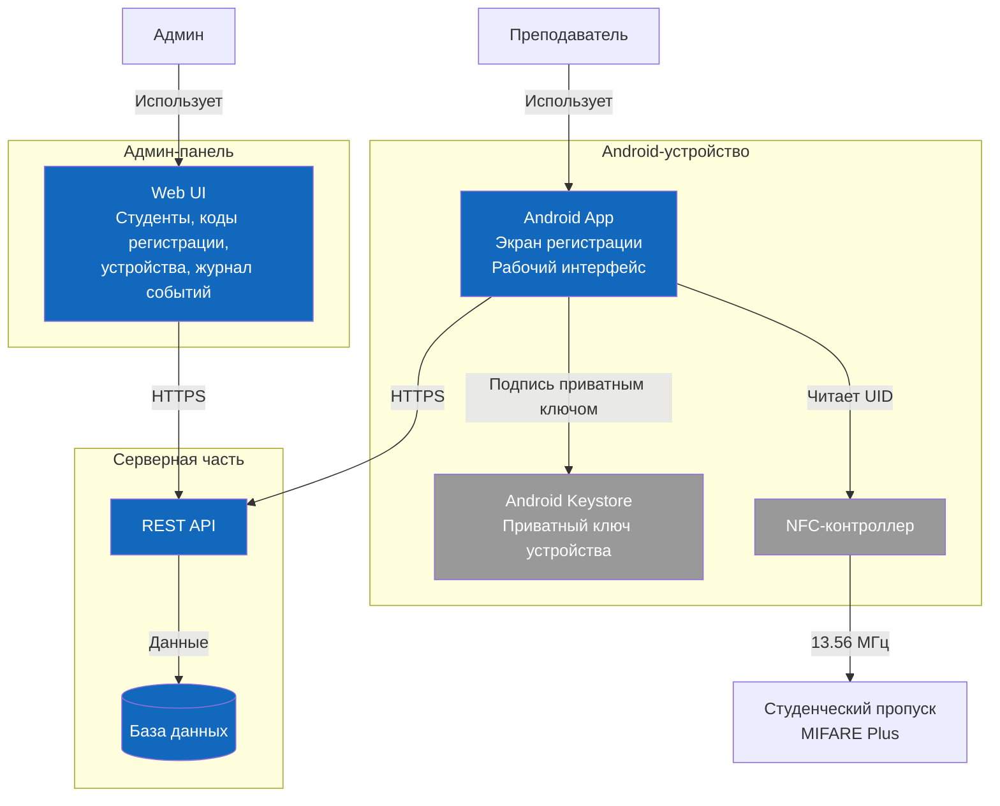

### C3. Component — Android-приложение

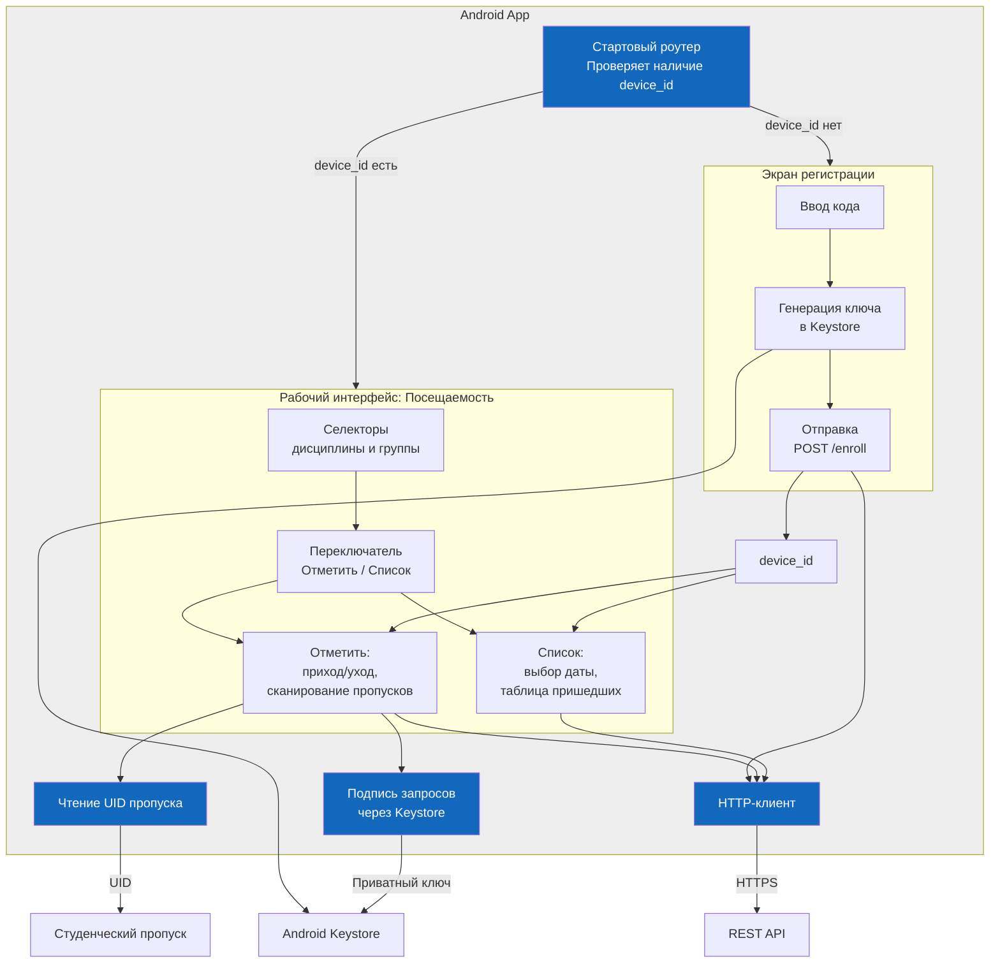

**Логика навигации:**
- При запуске приложение проверяет `device_id` в локальном хранилище.
- Устройство не зарегистрировано → показывается только экран регистрации.
- Устройство зарегистрировано → открывается рабочий интерфейс «Посещаемость».
- Внутри «Посещаемости» — селекторы дисциплины и группы, общие для режимов «Отметить» и «Список».

Если устройство нужно перерегистрировать, администратор удаляет данные приложения на устройстве. При следующем запуске приложение снова покажет экран регистрации.

### C3. Component — Серверная часть

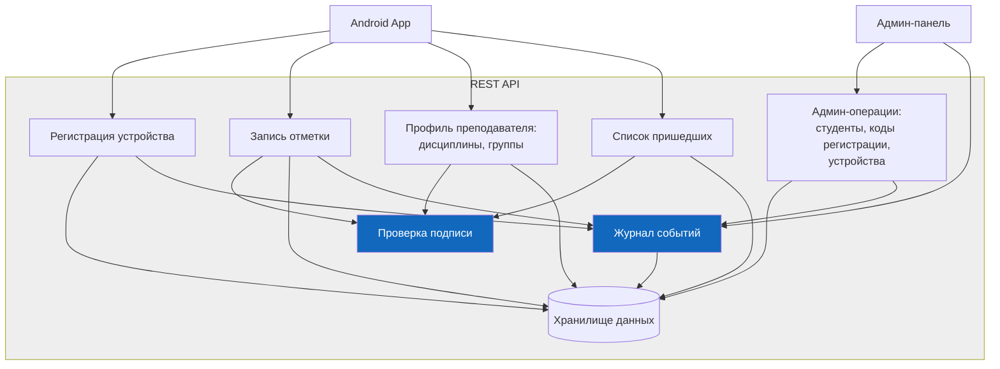

**Проверка при записи отметки:**
- Подпись валидна.
- Устройство активно.
- `teacher_subjects.teacher_id = devices.teacher_id`. Иначе `403`.
- `teacher_subjects.active = true`.

### C4. Deployment

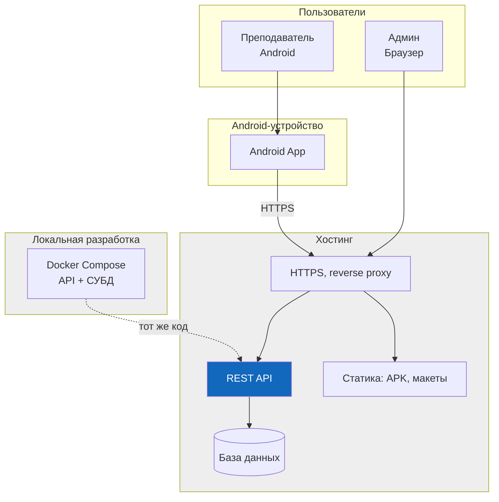

## Криптография и аутентификация

Используется ECDSA и хеш SHA-256. Приватный ключ создаётся в Android Keystore с аппаратной защитой и никогда не покидает устройство. При регистрации на сервер передаётся только публичный ключ.

При каждом запросе Android подписывает строку `method + path + body + timestamp` приватным ключом. Подпись передаётся в заголовке `X-Signature`. Сервер проверяет её публичным ключом, сохранённым при регистрации.

Android Keystore — системное хранилище ключей. На современных устройствах оно опирается на аппаратный модуль, поэтому извлечь приватный ключ даже при root-доступе нельзя.

Формат аутентификации админа — JWT или серверные сессии — определяется после выбора фреймворка бэкенда. JWT проще для SPA, серверные сессии легче отзывать. Решение фиксируется в описании технологии Backend Core.

Пароли админов хранятся в виде bcrypt-хеша.

## Схема данных

Первичные ключи — `id` типа `bigint` с автоинкрементом, если не указано иное. В колонках «Тип (PostgreSQL)» и «Тип (MySQL)» указаны различия между СУБД. Где различий нет — тип одинаков.

**Важно:** таблицы ниже описывают целевую схему, одинаковую для обеих СУБД по смыслу. Скрипты миграций пишутся только под ту СУБД, которая выбрана после определения хостинга. Две колонки с типами — для понимания различий, а не для параллельной разработки.

### admins

Администраторы системы.

| Поле | Тип (PostgreSQL) | Тип (MySQL) | Ограничения | Описание |
|---|---|---|---|---|
| id | bigint | BIGINT | PK, NOT NULL | Первичный ключ |
| login | varchar | VARCHAR | NOT NULL, UNIQUE | Уникальный логин |
| password_hash | varchar | VARCHAR | NOT NULL | bcrypt-хеш пароля, cost 12 |
| active | boolean | TINYINT(1) | NOT NULL, default true | Активен ли админ |
| created_at | timestamptz | TIMESTAMP | NOT NULL | Дата создания |

Индексы:
- `unique (login)`

### teachers

Преподаватели.

| Поле | Тип (PostgreSQL) | Тип (MySQL) | Ограничения | Описание |
|---|---|---|---|---|
| id | bigint | BIGINT | PK, NOT NULL | Первичный ключ |
| full_name | varchar | VARCHAR | NOT NULL | ФИО |
| active | boolean | TINYINT(1) | NOT NULL, default true | Активен ли преподаватель |
| created_at | timestamptz | TIMESTAMP | NOT NULL | Дата создания |

### devices

Зарегистрированные Android-устройства.

| Поле | Тип (PostgreSQL) | Тип (MySQL) | Ограничения | Описание |
|---|---|---|---|---|
| id | varchar | VARCHAR | PK, NOT NULL | Идентификатор, генерируется приложением |
| teacher_id | bigint | BIGINT | FK → teachers.id, NOT NULL | Преподаватель, к которому привязано устройство |
| public_key | text | TEXT | NOT NULL | Публичный ключ ECDSA P-256 |
| active | boolean | TINYINT(1) | NOT NULL, default true | Активно ли устройство |
| created_at | timestamptz | TIMESTAMP | NOT NULL | Дата регистрации |

Индексы:
- `index (teacher_id)`

### enrollment_codes

Одноразовые коды для регистрации устройств.

| Поле | Тип (PostgreSQL) | Тип (MySQL) | Ограничения | Описание |
|---|---|---|---|---|
| code | varchar | VARCHAR | PK, NOT NULL | Случайная строка |
| teacher_id | bigint | BIGINT | FK → teachers.id, NOT NULL | Для кого выдан код |
| created_by_admin | bigint | BIGINT | FK → admins.id, NOT NULL | Кто выдал код |
| expires_at | timestamptz | TIMESTAMP | NOT NULL | Срок действия |
| used_at | timestamptz | TIMESTAMP | NULL | Дата использования |
| created_at | timestamptz | TIMESTAMP | NOT NULL | Дата создания |

### subjects

Дисциплины.

| Поле | Тип (PostgreSQL) | Тип (MySQL) | Ограничения | Описание |
|---|---|---|---|---|
| id | bigint | BIGINT | PK, NOT NULL | Первичный ключ |
| name | varchar | VARCHAR | NOT NULL | Название |

### groups

Учебные группы.

| Поле | Тип (PostgreSQL) | Тип (MySQL) | Ограничения | Описание |
|---|---|---|---|---|
| id | bigint | BIGINT | PK, NOT NULL | Первичный ключ |
| name | varchar | VARCHAR | NOT NULL | Название |

### teacher_subjects

Связь преподавателя с дисциплиной и группой.

| Поле | Тип (PostgreSQL) | Тип (MySQL) | Ограничения | Описание |
|---|---|---|---|---|
| id | bigint | BIGINT | PK, NOT NULL | Первичный ключ |
| teacher_id | bigint | BIGINT | FK → teachers.id, NOT NULL | Преподаватель |
| subject_id | bigint | BIGINT | FK → subjects.id, NOT NULL | Дисциплина |
| group_id | bigint | BIGINT | FK → groups.id, NOT NULL | Группа |
| active | boolean | TINYINT(1) | NOT NULL, default true | Активна ли связь |
| created_at | timestamptz | TIMESTAMP | NOT NULL | Дата создания |

Индексы:
- PostgreSQL: `index (teacher_id, subject_id, group_id) where active = true`
- MySQL: `index (teacher_id, subject_id, group_id, active)`

### students

Студенты.

| Поле | Тип (PostgreSQL) | Тип (MySQL) | Ограничения | Описание |
|---|---|---|---|---|
| id | bigint | BIGINT | PK, NOT NULL | Первичный ключ |
| full_name | varchar | VARCHAR | NULL | ФИО. Зануляется при отзыве согласия |
| uid | varchar | VARCHAR | NULL, UNIQUE | UID пропуска. Зануляется при отзыве согласия |
| group_id | bigint | BIGINT | FK → groups.id, NOT NULL | Группа |
| consent_document | varchar | VARCHAR | NOT NULL | Номер бумажного согласия |
| consent_date | date | DATE | NOT NULL | Дата подписания согласия |
| revocation_document | varchar | VARCHAR | NULL | Номер заявления об отзыве |
| revocation_date | date | DATE | NULL | Дата заявления об отзыве |
| anonymized_at | timestamptz | TIMESTAMP | NULL | Дата фактического обезличивания |
| created_at | timestamptz | TIMESTAMP | NOT NULL | Дата добавления |

Индексы:
- `unique (uid)`

### attendance

Отметки посещаемости.

| Поле | Тип (PostgreSQL) | Тип (MySQL) | Ограничения | Описание |
|---|---|---|---|---|
| id | bigint | BIGINT | PK, NOT NULL | Первичный ключ |
| student_id | bigint | BIGINT | FK → students.id, NOT NULL | Студент |
| teacher_subject_id | bigint | BIGINT | FK → teacher_subjects.id, NOT NULL | Связь «преподаватель + дисциплина + группа» |
| device_id | varchar | VARCHAR | FK → devices.id, NOT NULL | С какого устройства отмечено |
| event_type | varchar | VARCHAR | NOT NULL | `check_in` / `check_out` |
| timestamp | timestamptz | TIMESTAMP | NOT NULL | Время отметки |

Индексы:
- `index (teacher_subject_id, timestamp)`

### event_log

Журнал событий: неуспешные попытки и важные действия. Используется для разбора инцидентов.

| Поле | Тип (PostgreSQL) | Тип (MySQL) | Ограничения | Описание |
|---|---|---|---|---|
| id | bigint | BIGINT | PK, NOT NULL | Первичный ключ |
| event_type | varchar | VARCHAR | NOT NULL | Тип события |
| severity | varchar | VARCHAR | NOT NULL | `info` / `warning` / `error` |
| meta | jsonb | JSON | NOT NULL, default '{}' | Контекст события |
| timestamp | timestamptz | TIMESTAMP | NOT NULL | Время события |

**Индексы PostgreSQL:**
- `index (timestamp)`
- `index (severity, timestamp)`
- `index (event_type, timestamp)`
- `index using gin (meta)` — для фильтрации по полям внутри JSONB

**Индексы MySQL:**
- `index (timestamp)`
- `index (severity, timestamp)`
- `index (event_type, timestamp)`
- Generated columns + индексы по часто используемым полям `meta`:
  ```sql
  device_id VARCHAR(64) GENERATED ALWAYS AS
      (JSON_UNQUOTE(JSON_EXTRACT(meta, '$.device_id'))) STORED,
  uid VARCHAR(64) GENERATED ALWAYS AS
      (JSON_UNQUOTE(JSON_EXTRACT(meta, '$.uid'))) STORED,
  INDEX idx_device_id (device_id),
  INDEX idx_uid (uid)
  ```

**Что в `meta`:** все контекстные поля события — `device_id`, `uid`, `teacher_id`, `subject_id`, `group_id`, `details` и любые другие, специфичные для конкретного типа. Новые типы событий не требуют миграций.

**Что не хранится:** тела запросов, IP-адреса, содержимое подписи.

**Retention:** записи старше 90 дней удаляются по расписанию. Error-события хранятся 180 дней.

### Типы событий

**Безопасность:**

| Событие | Severity | Когда возникает |
|---|---|---|
| invalid_signature | error | Подпись не сходится |
| expired_timestamp | warning | Timestamp старше 30 секунд |
| unknown_device | error | `device_id` не найден в БД |
| device_revoked | warning | Устройство отозвано |
| admin_login_failed | warning | Неверный логин или пароль админа |

**Регистрация устройства:**

| Событие | Severity | Когда возникает |
|---|---|---|
| enroll_code_invalid | warning | Кода нет в БД |
| enroll_code_expired | info | Код истёк |
| enroll_code_used | warning | Код уже использован |
| enroll_device_exists | info | `device_id` уже зарегистрирован |

**Отметки посещаемости:**

| Событие | Severity | Когда возникает |
|---|---|---|
| unknown_uid | warning | Карта не найдена в `students` |
| consent_revoked | info | Согласие отозвано |
| no_teacher_subject | error | Нет связи преподаватель-дисциплина-группа |
| student_wrong_group | warning | Студент не из выбранной группы |
| duplicate_check_in | info | Повторный `check_in` без `check_out` |
| check_out_without_in | warning | `check_out` без `check_in` |

**Админ-операции:**

| Событие | Severity | Когда возникает |
|---|---|---|
| student_consent_missing | warning | Добавление студента без обязательных полей согласия |
| revoke_without_document | warning | Отзыв согласия без номера заявления |

## Примеры записей в event_log

**Невалидная подпись:**
```json
{
  "event_type": "invalid_signature",
  "severity": "error",
  "timestamp": "2026-09-23T10:00:00Z",
  "meta": {
    "device_id": "abc-123",
    "reason": "signature mismatch"
  }
}
```

**Карта не найдена:**
```json
{
  "event_type": "unknown_uid",
  "severity": "warning",
  "timestamp": "2026-09-23T10:02:00Z",
  "meta": {
    "device_id": "abc-123",
    "uid": "04:XX:XX:XX",
    "subject_id": 5,
    "group_id": 12
  }
}
```

**Отозванное согласие:**
```json
{
  "event_type": "consent_revoked",
  "severity": "info",
  "timestamp": "2026-09-23T10:05:00Z",
  "meta": {
    "device_id": "abc-123",
    "uid": "04:XX:XX:XX",
    "student_id": 101,
    "teacher_id": 7
  }
}
```

**Неудачный вход админа:**
```json
{
  "event_type": "admin_login_failed",
  "severity": "warning",
  "timestamp": "2026-09-23T10:10:00Z",
  "meta": {
    "login": "admin",
    "reason": "wrong_password"
  }
}
```

## ER-диаграмма

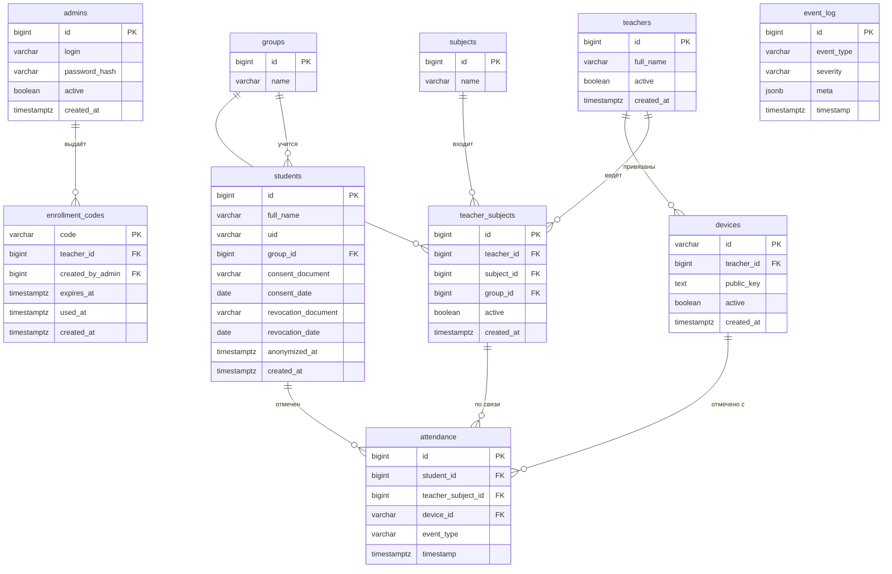

#### Справочник обозначений

| Символ | Значение | Пример в вашей схеме |
|---|---|---|
| `\|\|` | Ровно один (обязательный) | `teachers \|\|--o{ devices` — у устройства ровно один преподаватель |
| `o{` | Ноль или много | `teachers \|\|--o{ devices` — у преподавателя может быть ноль или много устройств |
| `\|{` | Один или много | `attendance }o--\|\| students` — отметка всегда привязана к одному студенту |

| Обозначение | Расшифровка | Где используется |
|---|---|---|
| `PK` | Primary Key, первичный ключ | `bigint id PK` |
| `FK` | Foreign Key, внешний ключ | `bigint teacher_id FK` |

| Связь | Кардинальность | Смысл |
|---|---|---|
| `admins → enrollment_codes` | один ко многим | Один админ выдаёт много кодов |
| `teachers → devices` | один ко многим | Один преподаватель может иметь много устройств |
| `teachers → teacher_subjects` | один ко многим | Один преподаватель ведёт много связей |
| `subjects → teacher_subjects` | один ко многим | Одна дисциплина входит во много связей |
| `groups → teacher_subjects` | один ко многим | Одна группа входит во много связей |
| `groups → students` | один ко многим | В одной группе много студентов |
| `students → attendance` | один ко многим | У одного студента много отметок |
| `teacher_subjects → attendance` | один ко многим | По одной связи много отметок |
| `devices → attendance` | один ко многим | С одного устройства много отметок |

**event_log — независимая таблица.** Контекстные ссылки хранятся в `meta` без внешних ключей. Целостность ссылок не проверяется на уровне БД — ответственность за корректность несёт код.

## Компоненты

### Ручные операции

**Согласие при добавлении студента.** Студент подписывает бумажное согласие. Сотрудник вуза принимает и проверяет документ, передаёт админу. Админ вносит студента в систему, указывая номер и дату согласия. Бумажный оригинал хранится в деле.

**Отзыв согласия.** Студент подаёт письменное заявление. Сотрудник вуза принимает и проверяет документ, передаёт админу. Админ заполняет форму отзыва в панели. Система зануляет персональные данные и фиксирует факт отзыва. Оригинал заявления хранится в деле.

**Акт об уничтожении.** Админ формирует акт по шаблону:

```
АКТ ОБ УНИЧТОЖЕНИИ ПЕРСОНАЛЬНЫХ ДАННЫХ

Дата: <дата>
Оператор: <название вуза>

На основании заявления №<номер> от <дата> об отзыве согласия
произведено уничтожение персональных данных студента:
— ФИО
— UID пропуска

Записи о посещаемости сохранены в обезличенном виде.
Восстановление персональных данных невозможно.

Ответственный: <ФИО админа>
Подпись: ______
```

Акт распечатывается, подписывается и хранится в деле.

### Сервер

#### Методы API

Все пути имеют префикс `/v1/`.

**Регистрация (без подписи):**

```http
POST /v1/enroll
{
  "code": "A7K9-2M4P",
  "device_id": "abc-123",
  "public_key": "<ECDSA P-256 public key>"
}
```

**Запросы преподавателя (подпись в заголовке):**

Заголовки:
- `X-Device-Id: abc-123`
- `X-Timestamp: 2026-09-23T10:00:00Z`
- `X-Signature: <подпись приватным ключом устройства>`

```http
GET /v1/me/subjects
```

Список дисциплин преподавателя. Обычно небольшой, пейджинг не требуется.

```http
GET /v1/me/groups?subject_id=5
```

Список групп для дисциплины. Обычно небольшой, пейджинг не требуется.

```http
POST /v1/attendance
{
  "uid": "04:XX:XX:XX",
  "subject_id": 5,
  "group_id": 12,
  "event_type": "check_in",
  "timestamp": "2026-09-23T10:00:00Z"
}
```

Сервер по `device_id` находит `teacher_id`, по `(teacher_id, subject_id, group_id, active=true)` находит `teacher_subject_id`. Если связи нет — `403`.

```http
GET /v1/me/attendance?subject_id=5&group_id=12&date=2026-09-23&page=1&size=50
```

Список пришедших за дату. **Пейджинг предусмотрен.** Параметры: `page` (номер страницы), `size` (размер страницы, по умолчанию 50, максимум 100). В ответе — `items`, `total`, `page`, `size`.

**Админ-операции:**

```http
POST /v1/admin/login
POST /v1/admin/change-password
```

```http
GET /v1/admin/students?group_id=12&consent_status=active&page=1&size=50
```

Список студентов. **Пейджинг предусмотрен.** Фильтры по группе и статусу согласия.

```http
POST /v1/admin/students
```

```http
POST /v1/admin/students/{id}/revoke
```

```http
POST /v1/admin/enrollment-codes
```

```http
GET /v1/admin/devices?teacher_id=7&active=true&page=1&size=50
```

Список устройств. **Пейджинг предусмотрен.** Фильтры по преподавателю и статусу.

```http
POST /v1/admin/devices/{id}/revoke
```

```http
GET /v1/admin/event-log?severity=warning&event_type=unknown_uid&date_from=2026-09-01&date_to=2026-09-30&page=1&size=50
```

Журнал событий. **Пейджинг предусмотрен.** Фильтры по severity, типу, дате, полям в `meta`.

Список кодов регистрации отдельным методом не выдаётся: код показывается на фронте один раз при создании. Если нужен новый — генерируется заново.

#### Формат ответов

**Успешный ответ:**
```json
{
  "status": "ok",
  "data": { ... }
}
```

**Ответ с ошибкой:**
```json
{
  "status": "error",
  "message": "Человекочитаемое описание"
}
```

HTTP-статусы используются стандартные: `200` — успех, `400` — невалидные данные, `401` — не аутентифицирован, `403` — нет доступа, `404` — не найдено.

#### Сводка по пейджингу

| Метод | Пейджинг | Причина |
|---|---|---|
| `GET /v1/me/subjects` | Нет | Малый объём данных |
| `GET /v1/me/groups` | Нет | Малый объём данных |
| `GET /v1/me/attendance` | **Да** | Может расти при большом потоке |
| `GET /v1/admin/students` | **Да** | Сотни и тысячи записей |
| `GET /v1/admin/devices` | **Да** | Десятки и сотни записей |
| `GET /v1/admin/event-log` | **Да** | Тысячи записей, обязательный пейджинг |

**Формат ответа с пейджингом:**

```json
{
  "status": "ok",
  "data": {
    "items": [...],
    "total": 1234,
    "page": 1,
    "size": 50
  }
}
```

**Параметры:** `page` (номер страницы, начиная с 1), `size` (размер страницы, по умолчанию 50, максимум 100). Для event-log максимум 200.

#### Зоны ответственности админ-операций

| Операция | Кто | Что делает |
|---|---|---|
| `POST /v1/admin/login` | Админ | Вход по логину и паролю |
| `POST /v1/admin/change-password` | Админ | Смена собственного пароля |
| `POST /v1/admin/students` | Админ | Добавление студента с обязательным указанием номера и даты согласия |
| `POST /v1/admin/students/{id}/revoke` | Админ | Отзыв согласия по номеру и дате заявления, зануление персональных данных |
| `POST /v1/admin/enrollment-codes` | Админ | Генерация одноразового кода для конкретного преподавателя |
| `POST /v1/admin/devices/{id}/revoke` | Админ | Отзыв устройства. После отзыва запросы с него отклоняются |
| `GET /v1/admin/event-log` | Админ | Журнал событий с фильтрами и пейджингом |

#### Как сервер проверяет подпись

1. По `X-Device-Id` находит устройство в таблице `devices`.
2. Проверяет, что `active = true`.
3. Достаёт `public_key`.
4. Восстанавливает подписанную строку: `method + path + body + X-Timestamp`.
5. Проверяет ECDSA-подпись из `X-Signature` публичным ключом с использованием SHA-256.
6. Проверяет, что `X-Timestamp` не старше 30 секунд.

Если хотя бы один шаг не проходит — `401` или `403`. Каждый отказ записывается в `event_log`.

#### Запись событий

В `event_log` пишет только сервер.

- **Backend Core** фиксирует события ядра: неуспешные отметки, регистрацию устройств, ошибки подписи, отозванные устройства.
- **DB + Admin API** фиксирует события админ-операций: вход админа, добавление студентов, отзывы согласий.

Android и админ-панель не пишут в журнал напрямую — они вызывают API, а сервер сам решает, какое событие записать. Доступ к журналу — через админ-панель, раздел «Журнал событий».

Все контекстные поля события (device_id, uid, teacher_id, subject_id, group_id, details и другие) хранятся в поле `meta` формата JSON (PostgreSQL: `jsonb`, MySQL: `JSON`). Это позволяет добавлять новые типы событий без миграций. Целостность ссылок в meta не проверяется на уровне БД — ответственность за корректность несёт код.

#### Накат (миграции и сиды)

Миграции и сиды пишутся **только под ту СУБД, которая выбрана после определения хостинга**. Сначала команда определяет хостинг, затем DB + Admin API смотрит, какая СУБД там доступна, и под неё пишутся скрипты. Инструмент миграций — на усмотрение разработчика после выбора фреймворка. Если фреймворк не требует явных миграций — не усложняем.

**Что попадает в сиды:**
- Дисциплины (`subjects`).
- Группы (`groups`).
- Преподаватели (`teachers`).
- Связи `teacher_subjects`.
- Один админ.

**Скрипт генерации админа (пример под выбранную СУБД):**

Для PostgreSQL:
```bash
#!/bin/sh
PASSWORD=$(openssl rand -base64 12)
HASH=$(htpasswd -bnBC 12 "" "$PASSWORD" | tr -d ':\n')

psql "$DATABASE_URL" <<SQL
INSERT INTO admins (login, password_hash, active)
VALUES ('admin', '$HASH', true);
SQL

echo "==========================================="
echo " Создан администратор"
echo " Логин: admin"
echo " Пароль: $PASSWORD"
echo " Сохраните пароль — он показан один раз."
echo "==========================================="
```

Для MySQL 8.0+:
```bash
#!/bin/sh
PASSWORD=$(openssl rand -base64 12)
HASH=$(htpasswd -bnBC 12 "" "$PASSWORD" | tr -d ':\n')

mysql "$DATABASE_URL" <<SQL
INSERT INTO admins (login, password_hash, active)
VALUES ('admin', '$HASH', 1);
SQL

echo "==========================================="
echo " Создан администратор"
echo " Логин: admin"
echo " Пароль: $PASSWORD"
echo " Сохраните пароль — он показан один раз."
echo "==========================================="
```

Пароль генерируется один раз, выводится в консоль контейнера и в открытом виде нигде не сохраняется. В базе хранится только bcrypt-хеш (cost 12).

### Android-приложение

#### Экраны

**Экран регистрации** показывается при отсутствии `device_id` в локальном хранилище.
- Поле ввода одноразового кода.
- При подтверждении: генерация ключевой пары в Android Keystore, формирование `device_id`, отправка `POST /v1/enroll`.
- При успехе `device_id` сохраняется локально, происходит переход в рабочий интерфейс.

**Рабочий интерфейс «Посещаемость»** открывается сразу после запуска, если `device_id` уже есть. Вкладок нет.
- Селекторы дисциплины и группы (данные тянутся с сервера через `GET /v1/me/subjects` и `GET /v1/me/groups`).
- Переключатель «Отметить» / «Список».
- В режиме «Отметить»: переключатель приход/уход и область сканирования пропусков.
- В режиме «Список»: выбор даты и таблица пришедших. Если записей много — постраничная навигация.

#### Что хранится локально

- `device_id`.
- Приватный ключ в Android Keystore.

Всё остальное (дисциплины, группы, списки) запрашивается с сервера.

#### Отображение списка пришедших

Для студентов с действующим согласием отображается ФИО. Для обезличенных — заглушка:

```json
{
  "status": "ok",
  "data": {
    "subject": "Математика",
    "group": "ИУ7-21",
    "date": "2026-09-23",
    "items": [
      { "full_name": "Иванов Иван", "check_in": "10:02", "check_out": "11:28" },
      { "full_name": "Студент (согласие отозвано)", "check_in": "10:05", "check_out": null }
    ],
    "total": 27,
    "page": 1,
    "size": 50
  }
}
```

#### Распространение и обновление APK

**Распространение.** Преподаватель получает release-APK по ссылке из админ-панели. Файл лежит в статике на том же хостинге, что API. Для проверок QA и командой используется тестовая APK с `BASE_URL`, указывающим на тестовый API.

**Обновление.** При выпуске новой версии админ-панель обновляет ссылку на файл. Преподаватель скачивает APK заново и устанавливает поверх старой версии. Данные приложения (`device_id`, ключ в Keystore) сохраняются — повторная регистрация не требуется.

### Админ-панель

#### Экраны

**Вход и смена пароля.**

**Студенты:**
- Список с фильтром по группе и статусу согласия, с пейджингом.
- Форма добавления: ФИО, группа, UID, номер и дата согласия — обязательные поля.
- Форма отзыва: номер и дата заявления.
- Кнопка «Сформировать акт» после отзыва.

**Коды регистрации:**
- Форма выбора преподавателя и генерации кода.
- Код показывается один раз при создании. Если нужен новый — генерируется заново.

**Устройства:**
- Список с фильтром по преподавателю и статусу, с пейджингом.
- Кнопка «Отозвать».

**Журнал событий** — единственная точка доступа к логам:
- Список записей с фильтром по severity, типу события и дате, с пейджингом.
- Фильтр по полям внутри `meta`: `device_id`, `uid`, `teacher_id`, `subject_id`, `group_id`.
- Цветовая маркировка: info — серый, warning — жёлтый, error — красный.
- Ссылки на связанные сущности: устройство, преподаватель, студент (если UID распознан).
- Просмотр деталей события — поле `meta` отображается как структурированный JSON.
- Экспорт в CSV.
- Автообновление списка раз в 30 секунд (опционально).

**Распространение APK:**
- Ссылка на release-APK. Файл лежит в статике на том же хостинге. При выпуске новой версии ссылка обновляется.

## Диаграммы последовательности

### 1. Накат системы и генерация админа

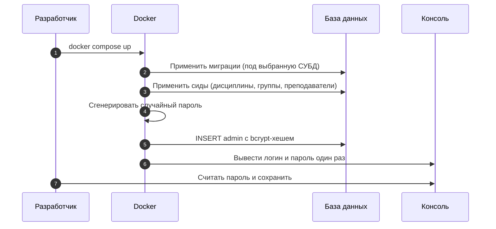

### 2. Регистрация устройства

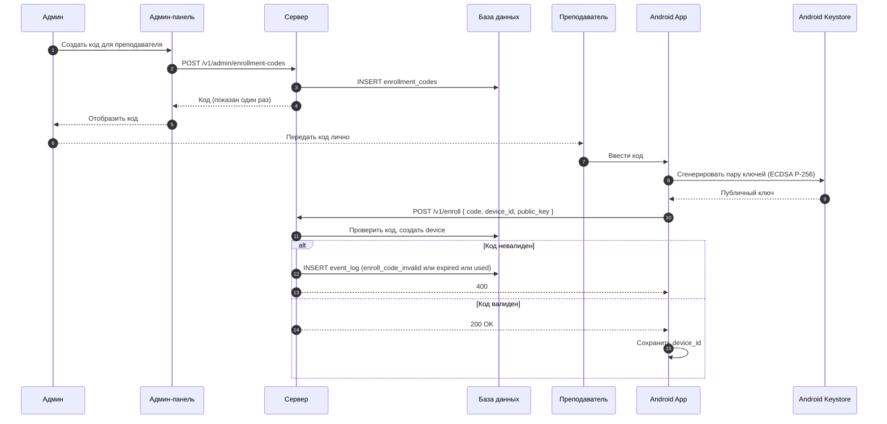

### 3. Отметка посещаемости

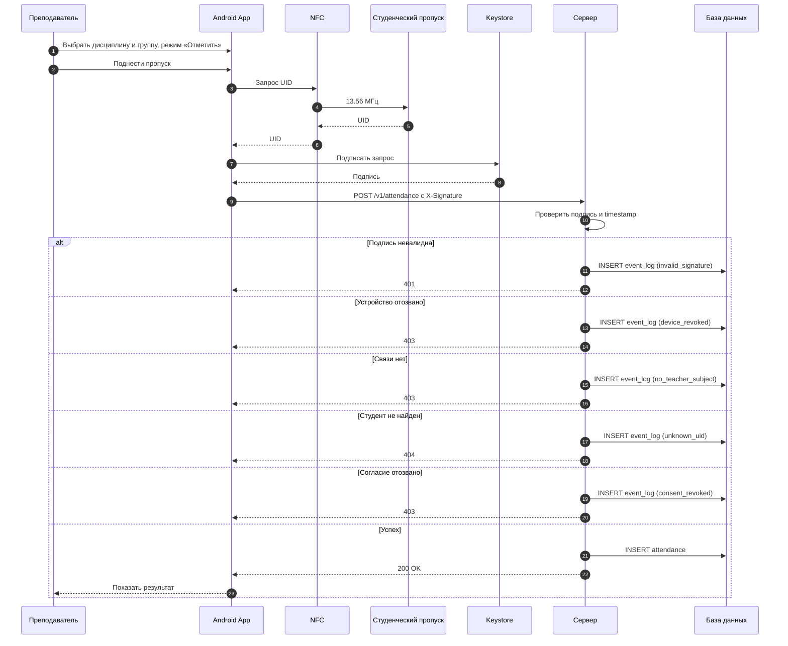

### 4. Получение списка пришедших

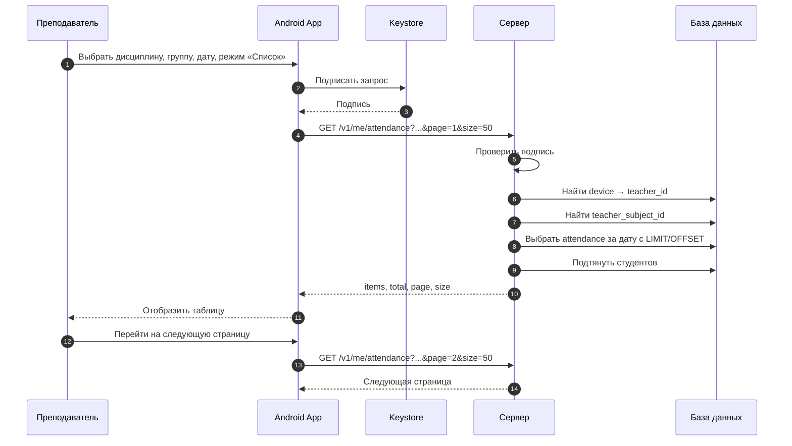

### 5. Отзыв согласия студента

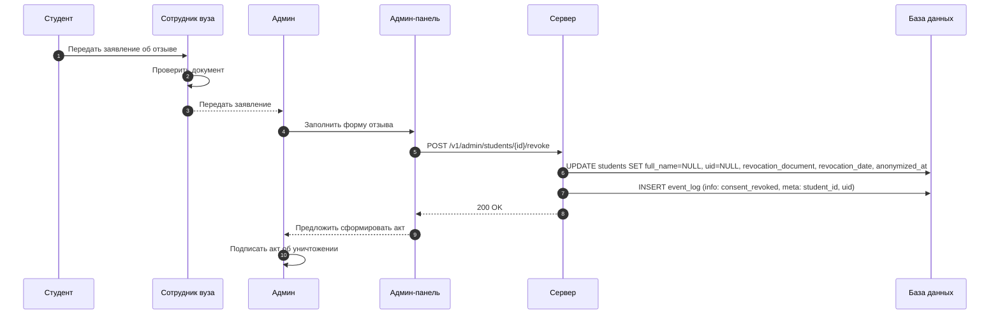

### 6. Добавление студента

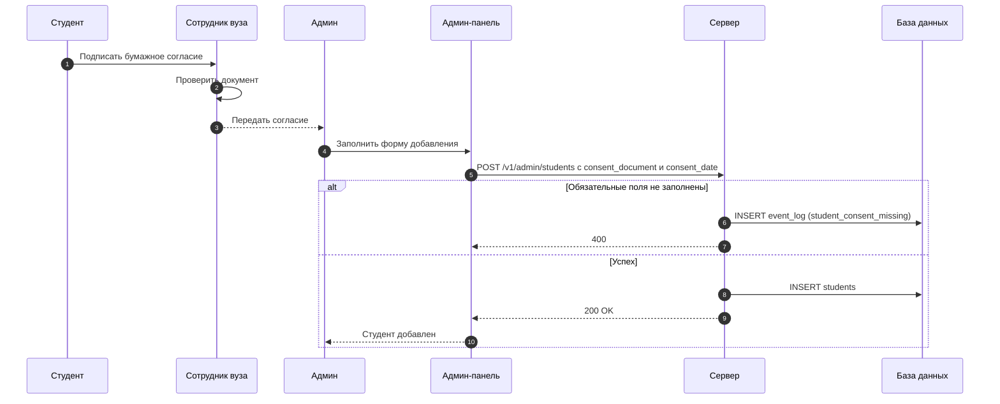

### 7. Просмотр журнала событий

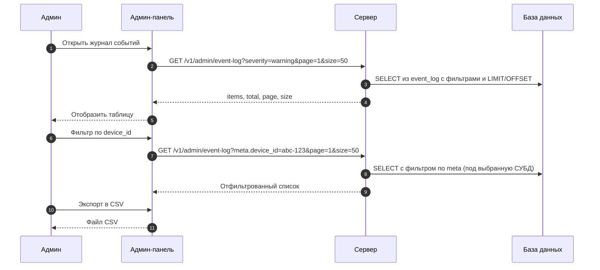

# Роли

| Роль | Зона ответственности |
|---|---|
| **DB + Admin API** | Схема данных, миграции (под выбранную после определения хостинга СУБД), накат, бэкапы, описание БД, админ-эндпоинты, деплой БД, таблица `event_log`, retention |
| **Backend Core** | Ядро API, middleware подписи, бизнес-логика отметок, деплой API, запись событий в `event_log`, пейджинг в ядре API, единый формат ответов, версионирование `/v1/` |
| **Android Core** | NFC, Keystore, подпись, HTTP-клиент, сервисы |
| **Android UI** | Экраны, навигация, ViewModel, отображение, постраничная навигация, сборка release-APK и тестовой APK |
| **Frontend / Admin Panel** | Веб-панель администратора, деплой админ-панели, размещение ссылки на APK, экран журнала событий (единственная точка доступа к логам), постраничная навигация |
| **Документация / Комплаенс + QA** | Документ архитектуры, 152-ФЗ, документы, инструкции, тест-план, интеграционные тесты, итоговый отчёт |

## Правила взаимодействия

- Драфт архитектуры (C1–C4, схема данных, диаграммы последовательности) — общая точка входа.
- Документация / Комплаенс + QA ведёт документ архитектуры, фиксирует изменения, но не утверждает архитектуру единолично — решения принимаются совместно.
- **Последовательность выбора хостинга и СУБД:** хостинги исследует команда — кто именно занимается исследованием, договариваются устно. После определения хостинга DB + Admin API определяет, какая СУБД доступна (PostgreSQL 10+ или MySQL 8.0+), и только после этого пишет миграции и сиды.
- **Технологический стек** (язык и фреймворк бэкенда, фреймворк фронтенда, UI Android, формат аутентификации админа, Git-хостинг) определяется командой в начале проекта. Предложения готовят соответствующие роли, финальное решение — совместное.
- Изменения в схеме данных согласуются между DB + Admin API, Backend Core и Android Core.
- Изменения в API фиксируются Backend Core и доводятся до Android Core, Android UI и Frontend.
- Юридические формулировки утверждает Документация / Комплаенс + QA.
- Разработчики пишут unit-тесты на свою часть. Интеграционное тестирование — на Документация / Комплаенс + QA.
- Каждая роль предоставляет описание выбранной технологии, инструкцию по эксплуатации своей части и скриншоты. Формат — на усмотрение автора, содержание обязательно.
- Итоговый отчёт собирает Документация / Комплаенс + QA из готовых блоков, которые присылают все роли.
- **Git-процесс.** Работа ведётся в монорепозитории по схеме: `main` ← `dev` ← `feature/<роль>-<описание>`. Прямые коммиты в `main` и `dev` запрещены. Merge только через Pull Request.
- **Ревью.** Изменения в API ревьюит Backend Core. Изменения в схеме данных — DB + Admin API. Изменения в контракте Android Core ↔ UI — Android Core. Изменения в документации — Документация / Комплаенс + QA.

## Граница Android Core ↔ UI

Core определяет интерфейсы первыми, до реализации. UI пишет экраны против интерфейсов с мок-реализациями. Изменения в контракте согласуются между Core и UI напрямую.

## Репозиторий и работа с Git

**Структура репозитория (монорепо):**

```
app/
├── docker-compose.yml
├── .env.example
├── README.md
├── backend/
│   ├── Dockerfile
│   └── ...
├── frontend/
│   ├── Dockerfile
│   └── ...
├── db/
│   ├── migrations/
│   └── seeds/
├── android/
│   └── ...
└── docs/
    ├── architecture.md
    ├── legal/
    └── instructions/
```

**Ветки:**

- `main` — стабильная версия. Защищена. Коммитить напрямую нельзя.
- `dev` — интеграционная ветка. Защищена. Коммитить напрямую нельзя.
- `feature/<роль>-<описание>` — для новых функций.
- `fix/<роль>-<описание>` — для исправлений.
- `docs/<описание>` — для документации.

**Рабочий процесс:**

1. Обновить `dev`: `git checkout dev && git pull`.
2. Создать ветку от `dev`: `git checkout -b feature/backend-attendance-endpoint`.
3. Работать и коммитить в свою ветку.
4. Пуш: `git push -u origin feature/backend-attendance-endpoint`.
5. Открыть Pull Request в `dev`.
6. Ревью от того, кто затронут. Изменения в API — ревью Backend Core. Изменения в схеме — ревью DB + Admin API.
7. После апрува — merge в `dev`.
8. Когда накопилось — `dev` сливается в `main`.

**Именование коммитов** (рекомендуется):

```
feat(backend): добавить endpoint отметки посещаемости
fix(android): исправить чтение UID при повторном сканировании
docs(152fz): обновить форму согласия
```

**Что не коммитить:**
- `.env` — только `.env.example` с описанием переменных.
- `docker-compose.override.yml` — личные настройки разработчика.
- Секреты: ключи, пароли, строки подключения.

**Что коммитить обязательно:**
- `docker-compose.yml` — один на всех.
- `.env.example` — с пустыми значениями и комментариями.
- `README.md` — инструкция по запуску.

## Инфраструктура и деплой

Деплой каждой части — ответственность соответствующей роли.

- **Frontend** — деплой админ-панели, размещение ссылки на APK в админ-панели.
- **Backend Core** — деплой API.
- **DB + Admin API** — деплой БД, накат миграций и сидов на прод-инстанс.
- **Android UI** — сборка release-APK и тестовой APK, передача файлов для публикации.

### Локальная разработка

**Принцип.** Чужие сервисы — в Docker. Свой код — нативно в IDE, но подключается к контейнерным сервисам. Это даёт быстрый старт, breakpoints из коробки и одинаковые версии СУБД у всей команды.

**Один `docker-compose.yml` в корне репозитория.** Описывает все сервисы: `postgres`, `api`, `admin`. Роль запускает только те, что ей нужны, — Docker сам поднимет зависимости через `depends_on`.

**Команды запуска по ролям:**

| Роль | Команда | Что поднимается |
|---|---|---|
| DB + Admin API | `docker compose up postgres` | Только БД |
| Backend Core | `docker compose up postgres` | БД, API запускает нативно |
| Frontend | `docker compose up postgres api` | БД и API, админку запускает нативно |
| Android Core | `docker compose up postgres api` | БД и API |
| Android UI | `docker compose up postgres api` | То же |
| Документация / QA | `docker compose up postgres api admin` | Всё целиком для проверки |

**Как запускать свой код нативно:**

- **Backend Core:** запускает `uvicorn`/`flask`/`gunicorn` локально, в `.env` указывает `DATABASE_URL=...localhost:5432...`. Контейнер `postgres` пробрасывает порт 5432 наружу.
- **Frontend:** запускает `npm run dev`/`vite` локально, в переменных окружения указывает `API_URL=http://localhost:8000`. Контейнер `api` (если запущен) пробрасывает 8000.
- **Android:** запускает приложение в Android Studio, `BASE_URL=http://10.0.2.2:8000` (эмулятор) или `http://<ваш-IP>:8000` (устройство в сети).

**Личные настройки.** Если нужно переопределить что-то только для себя, создаётся `docker-compose.override.yml` в корне. Он в `.gitignore` и не коммитится.

### Деплой на хостинг

**Хостинг без Docker.** Если хостинг не поддерживает контейнеры, развёртывание на проде делается вручную. Строка подключения задаётся через переменные окружения.

**Статика.** APK, макеты и другие медиа лежат в статике на том же хостинге, что API.

**Последовательность выбора инфраструктуры:**
1. Команда исследует доступные хостинги. Кто именно занимается исследованием — договариваются устно.
2. Команда определяет хостинг и доступную на нём СУБД.
3. DB + Admin API пишет миграции и сиды под выбранную СУБД.
4. Backend Core деплоит API.

Две среды (тест и прод) реализуются через два аккаунта на хостинге или два окружения в рамках одного аккаунта. Тестовая среда используется для проверок QA и командой: на ней разворачиваются тестовые сборки API, админ-панели и APK.

**Бэкапы прода.** На прод-инстансе БД настроен регулярный бэкап. Процедура восстановления описана в инструкции по эксплуатации БД. Ответственный — DB + Admin API.

**Retention event_log.** Записи старше 90 дней удаляются по расписанию. Error-события хранятся 180 дней. Ответственный — DB + Admin API.

## Требования к артефактам ролей

Формат — на усмотрение автора. Содержание обязательно.

| Роль | Что предоставляет |
|---|---|
| **DB + Admin API** | Описание технологии (СУБД, инструмент миграций — если используется), итоговое описание БД под выбранную СУБД, инструкция по эксплуатации, инструкция по деплою БД и накату на прод, скриншоты |
| **Backend Core** | Описание технологии (язык, фреймворк, ORM — если используется, формат аутентификации админа), OpenAPI с описанием пейджинга, единый формат ответов, форматы событий и структура `meta`, инструкция по эксплуатации, инструкция по деплою API, скриншоты |
| **Android Core** | Описание технологии (язык, библиотеки), документ с интерфейсами, инструкция, скриншоты |
| **Android UI** | Описание технологии (UI-стек: Compose или XML), макеты, инструкция для преподавателя, скриншоты, release-APK и тестовая APK |
| **Frontend** | Описание технологии (фреймворк, инструменты сборки), макеты, инструкция для админа, инструкция по деплою админ-панели, скриншоты, макет экрана журнала событий |

## Расширенная сводная таблица по этапам

| Этап | DB + Admin API | Backend Core | Android Core | Android UI | Frontend | Документация / Комплаенс + QA |
|---|---|---|---|---|---|---|
| **Проектирование** | ER-диаграмма, таблицы, индексы (с вариантами под PostgreSQL и MySQL для понимания), контракты админ-API с пейджингом, схема `event_log` | C3 серверная часть, контракты ядра API с пейджингом, формат подписи, выбор языка и фреймворка бэкенда и формата аутентификации админа, единый формат ответов, версионирование `/v1/`, границы с DB, форматы событий и структура `meta` | Интерфейсы для UI, согласование формата подписи и заголовков | Экраны, навигация, контракт с Core, постраничная навигация, выбор UI-стека | Экраны админки, контракты с админ-API с пейджингом, экран журнала событий, выбор фреймворка фронтенда | 152-ФЗ, формы, акты, документ архитектуры, тест-план |
| **Разработка** | Миграции и сиды под **выбранную** СУБД, откаты, генерация админа, накат, бэкапы, админ-эндпоинты с пейджингом, транзакции, контейнеризация БД, таблица `event_log`, retention | Эндпоинты ядра с пейджингом, middleware подписи, бизнес-логика отметки, Docker (локально), HTTPS, контейнеризация API, запись событий с `meta`, единый формат ответов | Keystore, подпись, ApiClient, сервисы, NFC, обработка ошибок | Экран регистрации, рабочий интерфейс, навигация, отображение ошибок и списка, постраничная навигация | Авторизация, экраны студентов, акт, коды, устройства, валидация форм, контейнеризация админ-панели, экран журнала событий, постраничная навигация | Документы, тексты на экранах, тестовые данные, чек-лист сдачи |
| **Тестирование** | Unit: миграции (под выбранную СУБД), откат, админ-эндпоинты, пейджинг, целостность, отзыв согласия, event_log | Unit: подпись, бизнес-логика отметки, транзакции, пейджинг, запись событий, формат ответов | Unit: Keystore, подписываемая строка, сервисы с мок-HTTP, ручное NFC | Unit: ViewModel, ручное тестирование UI, навигация по страницам | Unit: валидация форм, клиент API, ручные сценарии админа, экран журнала, пейджинг | Интеграционное тестирование на тестовой среде, защищённость, регресс, баг-репорты |
| **Релиз** | Деплой БД на выбранный хостинг (PostgreSQL 10+ или MySQL 8.0+ — по факту), накат миграций и сидов на прод-инстанс, скрипты бэкапов и восстановления, развёртывание тестовой БД | Деплой API (Docker или ручное развёртывание), HTTPS, публичный URL, настройка прод- и тест-среды, развёртывание тестового API | Core-модуль, документация контракта для UI | Release-APK с продовым `BASE_URL`, тестовая APK с тестовым `BASE_URL`, передача файлов для публикации | Деплой админ-панели, настройка прод- и тест-среды, развёртывание тестовой админ-панели, размещение ссылки на APK | Финальная проверка документов, приёмка |
| **Итоговый отчёт** | Описание технологии, итоговое описание БД, инструкция по эксплуатации, скриншоты | Описание технологии, OpenAPI с пейджингом, форматы событий, инструкция по эксплуатации, скриншоты | Описание технологии, документ с интерфейсами, инструкция, скриншоты | Описание технологии, макеты, инструкция для преподавателя, скриншоты | Описание технологии, макеты, инструкция для админа, скриншоты | Сборка и оформление итогового отчёта |

Формат отчёта роли — на усмотрение автора, итоговый отчёт — по образцу дисциплины.